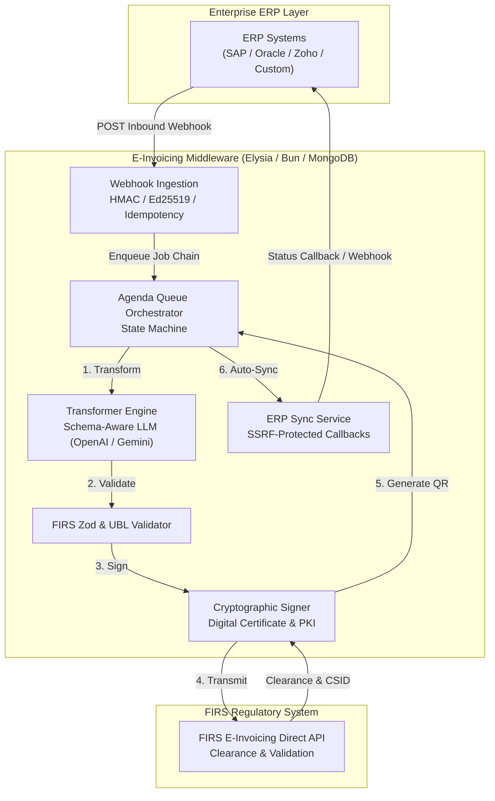
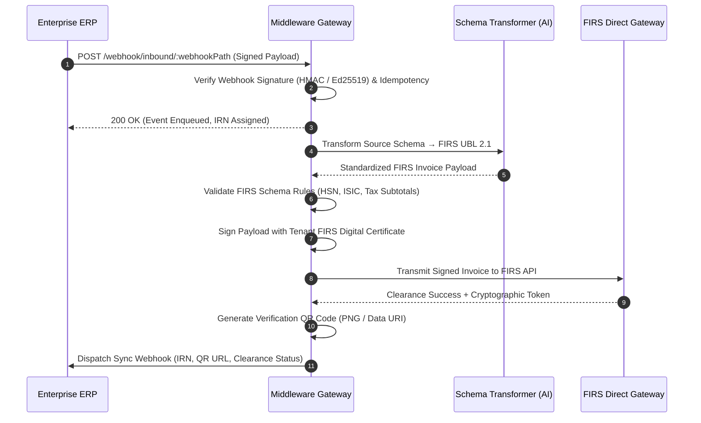

# FIRS E-Invoicing Middleware

Enterprise-grade, high-throughput e-invoicing middleware and integration gateway connecting enterprise ERP systems (SAP, Oracle, Microsoft Dynamics, NetSuite, Zoho, and custom proprietary platforms) to Nigeria's **Federal Inland Revenue Service (FIRS)** E-Invoicing platform.

---

## Table of Contents
1. [Overview](#overview)
2. [High-Level Architecture](#high-level-architecture)
3. [Key Features](#key-features)
4. [Integration & Compliance Flow](#integration--compliance-flow)
   - [1. Tenant Onboarding & Cryptographic Credentials](#1-tenant-onboarding--cryptographic-credentials)
   - [2. Inbound Ingestion & Webhook Verification](#2-inbound-ingestion--webhook-verification)
   - [3. AI-Powered Schema Transformation](#3-ai-powered-schema-transformation)
   - [4. Cryptographic Signing & FIRS Transmission](#4-cryptographic-signing--firs-transmission)
   - [5. Dynamic QR Code Generation](#5-dynamic-qr-code-generation)
   - [6. Credit Notes & Adjustments](#6-credit-notes--adjustments)
   - [7. ERP Synchronization & Callback Engine](#7-erp-synchronization--callback-engine)
5. [Security & Enterprise Hardening](#security--enterprise-hardening)
6. [Job Queue & Async State Machine](#job-queue--async-state-machine)
7. [API Endpoint Reference](#api-endpoint-reference)
8. [Configuration & Environment Variables](#configuration--environment-variables)
9. [Getting Started & Local Development](#getting-started--local-development)
10. [Testing & Quality Assurance](#testing--quality-assurance)

---

## Overview

The FIRS E-Invoicing Middleware provides a resilient, multi-tenant layer that transforms disparate ERP invoice structures into strict **FIRS UBL 2.1** compliant electronic invoices, signs them cryptographically, clears them with FIRS servers, issues verifiable QR codes, and synchronizes status updates back into the originating ERP system.

Designed for high-throughput enterprises processing tens of thousands of daily transactions with zero data loss, strict idempotency, and automated recovery mechanisms.

---

## High-Level Architecture



---

## Key Features

- **Multi-Tenant Architecture**: Complete tenant data isolation, custom ERP schemas, per-tenant credentials, and API key management.
- **AI-Powered Schema Transformation**: Dual-engine transformer (Deterministic mapping + Schema-Aware LLM auto-fix) converting non-standard ERP JSON into compliant FIRS UBL 2.1 format.
- **Strict Cryptographic Security**: AES-256-GCM encryption for stored certificates, private keys, and API secrets.
- **SSRF Protection with DNS Pinning**: Outbound ERP webhooks and callbacks validated against private IP ranges, loopback addresses, and DNS rebinding attacks.
- **Idempotency & Replay Protection**: Cryptographic deduplication prevents double-submissions and duplicate invoices.
- **Asynchronous Job Chain Pipeline**: Agenda-backed state machine handles high volume, backoff retries, and network fault tolerance.
- **Real-Time Monitoring**: Server-Sent Events (SSE) stream for live webhook ingestion monitoring and transaction logs.
- **Credit Note & Billing Reference Resolution**: Automatic pairing and linking of credit/debit notes with original cleared invoices.

---

## Integration & Compliance Flow



### 1. Tenant Onboarding & Cryptographic Credentials
1. Tenant is provisioned via `POST /api/v1/tenants/admin`.
2. Activation email is dispatched to tenant owner with secure onboarding token.
3. Tenant uploads their FIRS Public Key, Private Key/Certificate, Service ID, and Business ID via `PUT /api/v1/tenants/onboarding/credentials`.
4. Webhook URLs and ERP sync settings are configured.

### 2. Inbound Ingestion & Webhook Verification
- Webhooks arrive at `/webhook/inbound/:webhookPath`.
- Header `x-signature` is verified against the tenant's configured shared secret (HMAC-SHA256) or public key (Ed25519).
- Idempotency key (`x-idempotency-key` or SHA-256 hash of payload) prevents duplicate job execution.
- If payload is valid, a unique Invoice Reference Number (**IRN**) is pre-allocated and the processing chain is queued.

### 3. AI-Powered Schema Transformation
- The pipeline resolves the tenant's ERP format (e.g. SAP, Oracle, Zoho) and loads field mapping rules.
- Deterministic rules execute first for exact matches.
- The Schema-Aware LLM engine (`FIRSInvoiceTransformerV2`) completes missing tax classifications, unit codes (UNECE Rec 20), WCO/HS codes, and address structures.
- Strict identity fields (`business_id`, `irn`, `accounting_supplier_party.tin`) are cryptographically preserved and guarded against tampering.

### 4. Cryptographic Signing & FIRS Transmission
- The normalized invoice is signed using the tenant's decrypted FIRS private key and certificate.
- The signed invoice payload is transmitted over mutual TLS / REST to FIRS e-invoicing servers.
- The response containing clearance tokens, cryptographic signatures, and status codes is persisted in `OutboundInvoiceRepository`.

### 5. Dynamic QR Code Generation
- Middleware constructs the FIRS-compliant QR payload containing IRN, Business ID, Tax Amounts, and cryptographic checksum.
- Available as a direct PNG endpoint: `GET /api/v1/invoicing/invoice/:irn/qr` (cacheable, CDN-friendly, embeddable in PDF generators).

### 6. Credit Notes & Adjustments
- Credit notes (`invoice_type_code: "380"` / `"381"`) are linked to original invoices via `billing_reference`.
- Middleware supports both full credit note payloads with lines and minimal notification events referencing prior IRNs.

### 7. ERP Synchronization & Callback Engine
- Once clearance is confirmed, the middleware dispatches a signed webhook back to the tenant's ERP system.
- Includes IRN, clearance status, QR code data URI, FIRS response timestamps, and audit metadata.

---

## Security & Enterprise Hardening

| Layer | Mechanism | Details |
|---|---|---|
| **Credential Storage** | AES-256-GCM | Tenant secrets, FIRS keys, and tokens encrypted at rest with PBKDF2 key derivation. |
| **Outbound Webhooks** | SSRF Validator | Outbound HTTP requests enforce DNS resolution checks blocking `10.0.0.0/8`, `172.16.0.0/12`, `192.168.0.0/16`, `127.0.0.1`, and cloud metadata IPs (`169.254.169.254`). |
| **Inbound Webhooks** | Cryptographic Signatures | Supports HMAC-SHA256, HMAC-SHA512, Ed25519, and RSA-SHA256 signatures. |
| **Authorization** | Role-Based Access Control | Strict segregation between Platform Super Admins, Tenant Admins, and API Keys with granular scopes. |
| **Rate Limiting** | Tiered Limiting | Route-level rate limiters for public endpoints, ingestion webhooks, and admin APIs. |
| **Injection Safety** | Prototype Pollution Defense | Object traversing and path mapping protected against `__proto__`, `constructor`, and `prototype` overwrites. |

---

## Job Queue & Async State Machine

The middleware uses **Agenda (MongoDB-backed)** to orchestrate asynchronous job chains:

```
[Inbound Webhook] 
       │
       ▼
[workflow:transform] ──▶ [workflow:validate] ──▶ [workflow:sign] ──▶ [workflow:transmit]
                                                                            │
                                                                            ▼
[workflow:sync-erp] ◀── [workflow:complete-outbound] ◀── [workflow:confirm-status]
```

- **Exponential Backoff**: Automatic retry on temporary FIRS network errors.
- **Fail-Safe Persistence**: Failure at any step records full diagnostic traces in `outbound_invoices` without dropping the transaction.
- **Real-Time Visibility**: Background transitions emit live SSE messages for observability.

---

## API Endpoint Reference

### Webhook Ingestion & Streaming
- `POST /webhook/inbound/:webhookPath` - Ingest invoice from tenant ERP.
- `GET /webhook/listen/:webhookPath` - Server-Sent Events (SSE) live event stream.
- `GET /webhook/events` - Query and filter webhook audit history.
- `GET /webhook/events/:eventId` - Retrieve single webhook event details.

### Invoicing & Clearance
- `GET /api/v1/invoicing/invoice/:irn/qr` - Stream invoice QR code image (PNG).
- `POST /api/v1/invoicing/outbound` - Direct synchronous invoice clearance.
- `GET /api/v1/invoicing/logs` - Search transaction logs by IRN, date, or status.

### Tenant Administration & Onboarding
- `POST /api/v1/tenants/admin` - Create new enterprise tenant.
- `GET /api/v1/tenants/admin` - List all registered tenants.
- `PUT /api/v1/tenants/admin/:tenantId/config` - Update ERP sync and webhook configuration.
- `POST /api/v1/tenants/admin/:tenantId/keys` - Provision tenant API keys.
- `PUT /api/v1/tenants/onboarding/credentials` - Upload FIRS certificates and credentials.

---

## Configuration & Environment Variables

Create a `.env` file in the root directory:

```env
# Server
PORT=3000
NODE_ENV=production
APP_URL=https://einvoicing.yourdomain.com

# Database
MONGODB_URI=mongodb://localhost:27017/einvoicing_db

# Security & Encryption
ENCRYPTION_SECRET=your-32-byte-hex-encryption-key
JWT_SECRET=your-jwt-signing-secret
ADMIN_API_KEY=super-admin-master-key

# AI Transformation Engine
AI_PROVIDER=gemini # or "openai"
AI_API_KEY=your-gemini-or-openai-api-key
AI_MODEL=gemini-2.0-flash # or "gpt-4o-mini"

# FIRS API Environment
FIRS_ENVIRONMENT=sandbox # or "production"
FIRS_SANDBOX_BASE_URL=https://e-invoicing-sandbox.firs.gov.ng
FIRS_PRODUCTION_BASE_URL=https://e-invoicing.firs.gov.ng
```

---

## Getting Started & Local Development

### Prerequisites
- [Bun](https://bun.sh) (v1.1.0 or newer)
- [MongoDB](https://www.mongodb.com) (v6.0 or newer)

### Installation
```bash
# Install dependencies
bun install

# Run database typechecking
bun x tsc --noEmit

# Start development server with hot reloading
bun run dev
```

The server will start at `http://localhost:3000`.

---

## Testing & Quality Assurance

Run the automated test suite:

```bash
# Run all unit and integration tests
bun test

# Run security & tenant access tests
bun test tests/tenant-admin-security.test.ts tests/security.test.ts

# Run currency resolution & template engine tests
bun test tests/currency-resolution.test.ts tests/template-engine.test.ts
```
