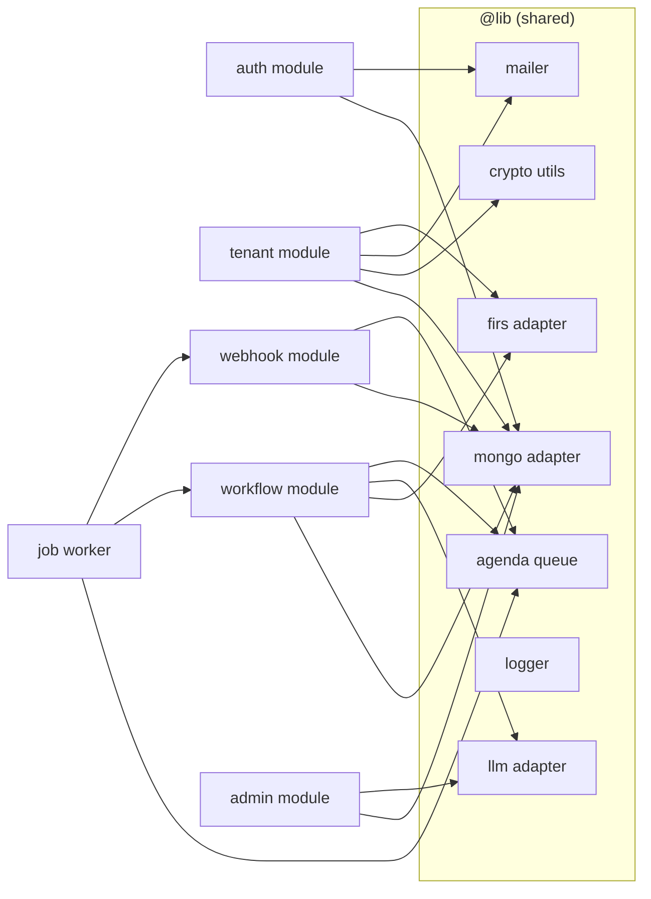
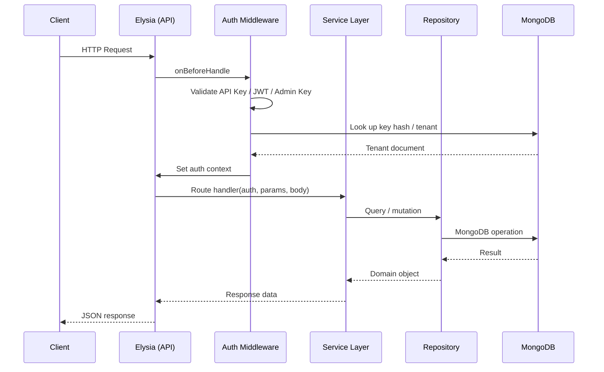
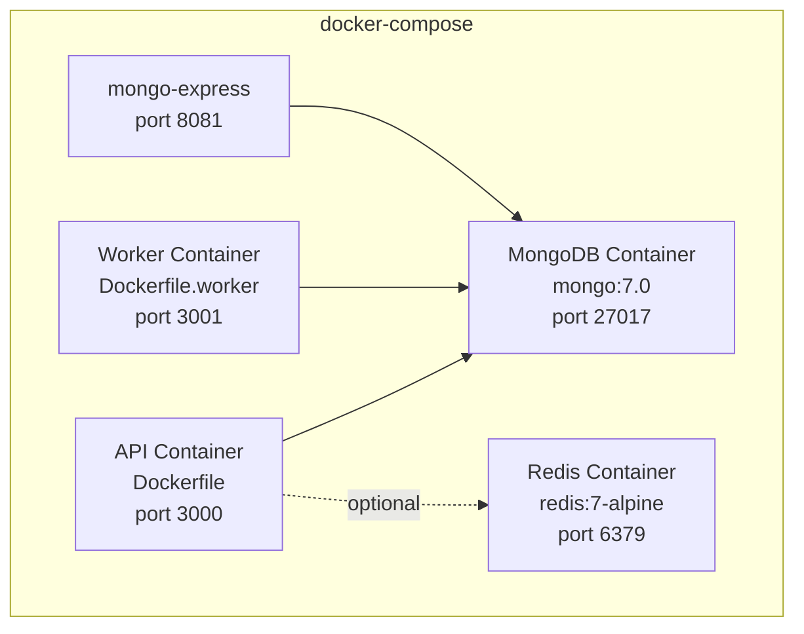
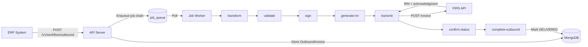
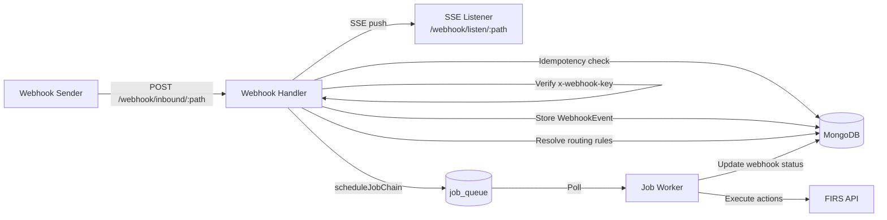

# Architecture

## System Overview

The E-Invoicing Middleware is composed of two independently deployable processes:

1. **API Server** (`src/index.ts`) — Handles all HTTP requests from clients, admins, and ERP systems.
2. **Job Worker** (`src/worker.ts`) — Runs background jobs for invoice processing. Hosts the Agendash dashboard.

Both processes share the same MongoDB instance. The API process enqueues jobs; the worker processes them.

---

## Component Diagram

```mermaid
graph TB
    subgraph Clients
        AD[Admin Dashboard]
        ERP[ERP System]
        FIRS_CLIENT[FIRS Platform]
        WH_SENDER[Webhook Sender]
    end

    subgraph API_SERVER["API Server (Bun + Elysia, port 3000)"]
        AUTH[Auth Module\n/v1/auth]
        TENANTS[Tenant Module\n/v1/tenants]
        WORKFLOW[Workflow Module\n/v1/workflow]
        WEBHOOK[Webhook Module\n/v1/webhook]
        ADMIN[Admin Module\n/v1/admin]
        INVOICING[Invoicing Module\n/v1/workflow/invoices]
    end

    subgraph WORKER["Job Worker (Bun, port 3001)"]
        AGENDA[Agenda Scheduler]
        JOBS[Job Definitions\n9 job types]
        AGENDASH[Agendash UI\nhttp://localhost:3001]
    end

    subgraph MONGODB["MongoDB"]
        COL_TENANTS[(tenants)]
        COL_APIKEYS[(api_keys)]
        COL_OUTBOUND[(outbound_invoices)]
        COL_INBOUND[(inbound_invoices)]
        COL_WEBHOOK[(webhook_events)]
        COL_DICT[(invoice_schema_dictionaries)]
        COL_ROUTING[(event_routing_configs)]
        COL_QUEUE[(job_queue)]
        COL_AUDIT[(audit_logs)]
    end

    subgraph EXTERNAL["External Services"]
        FIRS_API[FIRS API\neivc-k6z6d.ondigitalocean.app]
        LLM[Azure OpenAI\nGPT-4 Turbo]
        SMTP[SMTP\nHarp Sandbox :2525]
    end

    AD -->|x-admin-key| ADMIN
    AD -->|JWT / x-api-key| TENANTS
    ERP -->|x-api-key| WORKFLOW
    FIRS_CLIENT -->|x-webhook-key| WEBHOOK
    WH_SENDER -->|x-webhook-key| WEBHOOK

    AUTH --> COL_TENANTS
    TENANTS --> COL_TENANTS
    TENANTS --> COL_APIKEYS
    WORKFLOW --> COL_OUTBOUND
    WORKFLOW --> COL_INBOUND
    WORKFLOW --> COL_DICT
    WEBHOOK --> COL_WEBHOOK
    WEBHOOK --> COL_ROUTING
    ADMIN --> COL_DICT
    ADMIN --> COL_ROUTING

    WEBHOOK -->|scheduleJobChain| COL_QUEUE
    WORKFLOW -->|scheduleJobChain| COL_QUEUE

    AGENDA -->|poll every 2s| COL_QUEUE
    AGENDA --> JOBS
    JOBS --> COL_OUTBOUND
    JOBS --> COL_INBOUND
    JOBS --> COL_WEBHOOK

    JOBS -->|transmit| FIRS_API
    JOBS -->|sign / QR| FIRS_API
    ADMIN -->|generate dictionary| LLM
    TENANTS -->|welcome / reset| SMTP
```

---

## Module Dependency Graph

---

## Request Lifecycle

---

## Deployment Topology

---

## Data Flow — Outbound Invoice

---

## Data Flow — Inbound Webhook

