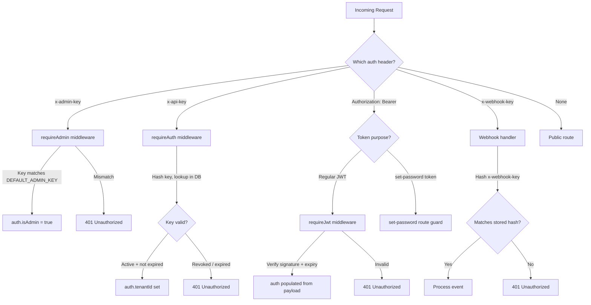
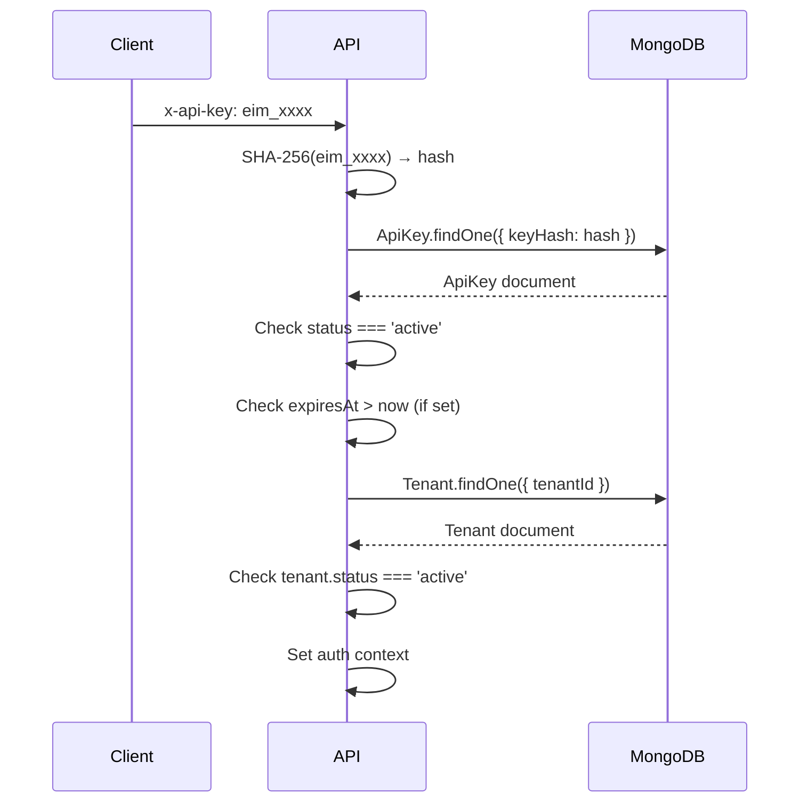
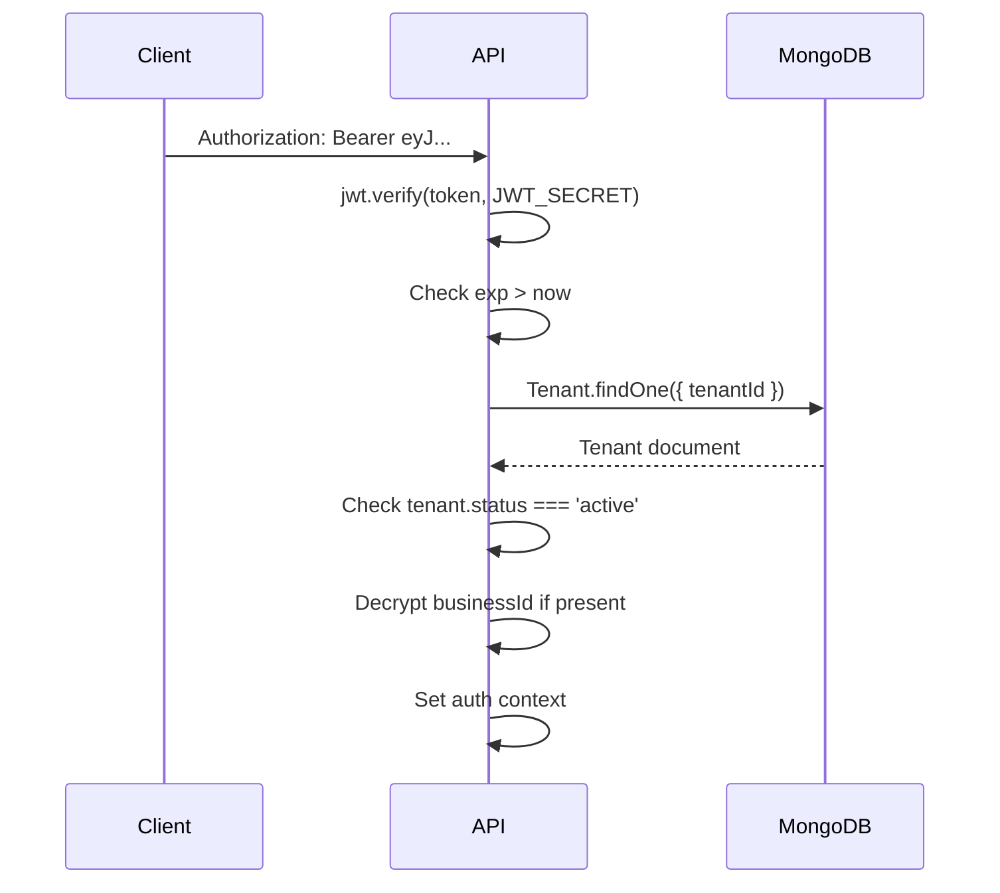

# Authentication & Authorization

The middleware supports four authentication mechanisms. Each is applied by a middleware plugin that populates `ctx.auth` before route handlers execute.

---

## Overview



---

## 1. Admin Key (`x-admin-key`)

Used for all `/v1/admin` routes and tenant CRUD operations.

**Header**: `x-admin-key: <secret>`

**Validation**:
```
incoming key === process.env.DEFAULT_ADMIN_KEY
```

**Auth context set**:
```typescript
ctx.auth = { isAdmin: true, type: 'admin' }
```

**Best practice for templating**: Store `DEFAULT_ADMIN_KEY` in a secrets manager (not `.env` in production). Rotate regularly.

---

## 2. API Key (`x-api-key`)

Used by ERP systems and integrations to call the workflow and invoicing endpoints.

**Header**: `x-api-key: eim_xxxxxxxxxxxxxxxx`

**Key format**: `eim_` prefix + 32 random hex chars

**Storage**: Only the SHA-256 hash is stored in MongoDB. The plaintext key is shown **once** at creation time.

**Validation flow**:


**Auth context set**:
```typescript
ctx.auth = {
  tenantId: "...",
  businessId: "...",      // decrypted from tenant record
  businessName: "Acme",
  type: "tenant",
  scopes: ["*"],          // from API key scopes field
  isAdmin: false,
}
```

**Key lifecycle**:
| State | Description |
|-------|-------------|
| `active` | Can authenticate |
| `revoked` | Blocked with reason and actor recorded |
| `expired` | `expiresAt` in the past |

---

## 3. JWT (`Authorization: Bearer`)

Used by the admin dashboard and frontend after login.

**Header**: `Authorization: Bearer eyJ...`

**Algorithm**: HS256 (configurable: HS256 | HS384 | HS512 | RS256)

**Secret**: `process.env.JWT_SECRET` (min 32 chars)

**Token payload**:
```typescript
{
  tenantId: string;
  businessId?: string;        // encrypted FIRS business ID
  email: string;
  businessName: string;
  type: "tenant" | "team_member";
  userId?: string;            // for team members
  scopes?: string[];
  purpose?: "set-password";   // for activation tokens
  iat: number;
  exp: number;
}
```

**Token types**:

| Type | Expiry | Purpose |
|------|--------|---------|
| Regular JWT | `JWT_EXPIRY` (default: 24h) | Normal authenticated sessions |
| Team member JWT | `JWT_EXPIRY` | Team member sessions |
| Set-password token | 1 hour | One-time token from activation email |

**Validation flow**:


---

## 4. Webhook Signature (`x-webhook-key`)

Used to authenticate inbound webhook senders. Each tenant has a unique webhook secret.

**Header**: `x-webhook-key: <secret>`

**Setup**:
1. Tenant calls `POST /tenants/:tenantId/webhook/generate`
2. System generates a random secret, stores its SHA-256 hash in `tenant.metadata.webhookSecretHash`
3. Returns the plaintext secret to the tenant once

**Validation**:
```typescript
const incoming = hashString(req.headers['x-webhook-key']);
const stored = tenant.metadata.webhookSecretHash;
if (incoming !== stored) throw new UnauthorizedError('Invalid webhook key');
```

**Idempotency**: To prevent duplicate processing, every webhook event is deduplicated using:
1. `x-idempotency-key` header (explicit, from sender)
2. If absent: SHA-256 of `${tenantId}:${eventType}:${JSON.stringify(payload)}`

If a matching event exists with status `DELIVERED` or `PENDING`, the request returns `409 Conflict`. Events with status `FAILED` may be retried.

---

## Authorization Guards

Route handlers use guard functions from `src/v1/auth/utils/access-checks.ts`:

```typescript
onlyAdmin(auth, 'message')       // throws 403 if not isAdmin
onlyTenant(auth, 'message')      // throws 403 if not type === 'tenant'
onlyTeamMember(auth, 'message')  // throws 403 if not type === 'team_member'
```

---

## Auth Context Shape

All middleware sets `ctx.auth` to the same shape:

```typescript
interface AuthContext {
  tenantId?: string;
  businessId?: string;
  businessTIN?: string;
  businessName?: string;
  email?: string;
  type?: 'tenant' | 'team_member' | 'admin';
  userId?: string;
  scopes?: string[];
  isAdmin: boolean;
}
```

---

## Security Recommendations for Template Reuse

1. **Never return `businessId` in logs** — it is an encrypted FIRS entity identifier
2. **Rotate `DEFAULT_ADMIN_KEY` regularly** — store in a vault, not env files
3. **Set short `JWT_EXPIRY`** (15m–1h) for production; use refresh tokens
4. **Always use HTTPS** — API key and JWT are bearer tokens
5. **Scope API keys** — the `scopes` field supports fine-grained permissions; enforce them in route handlers
6. **Webhook IPs** — consider IP allowlisting at the infrastructure level for webhook endpoints
