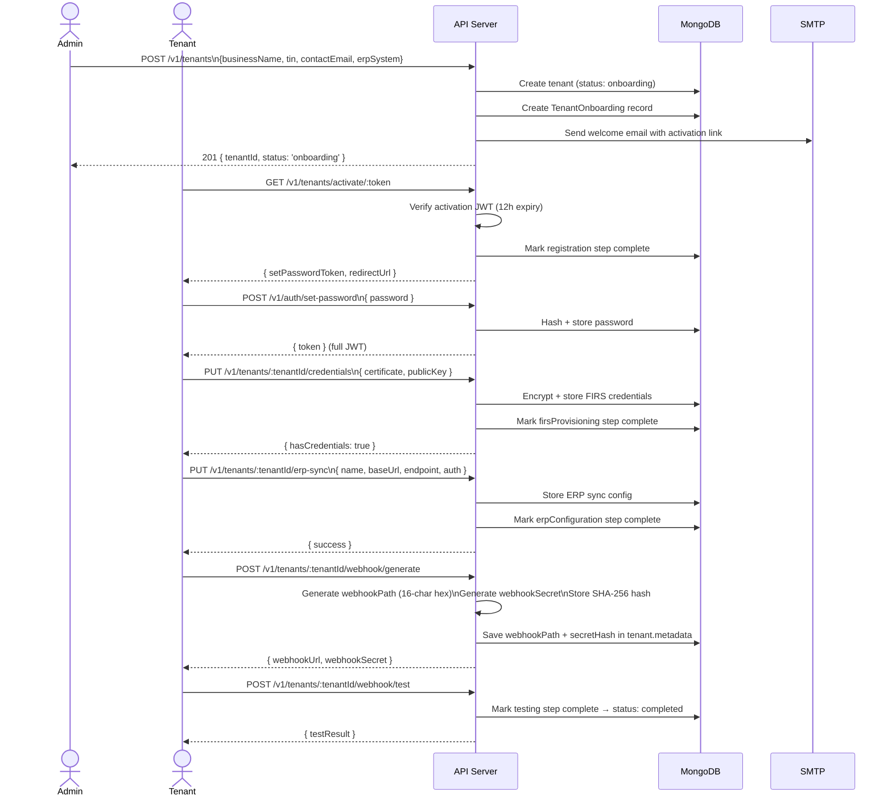
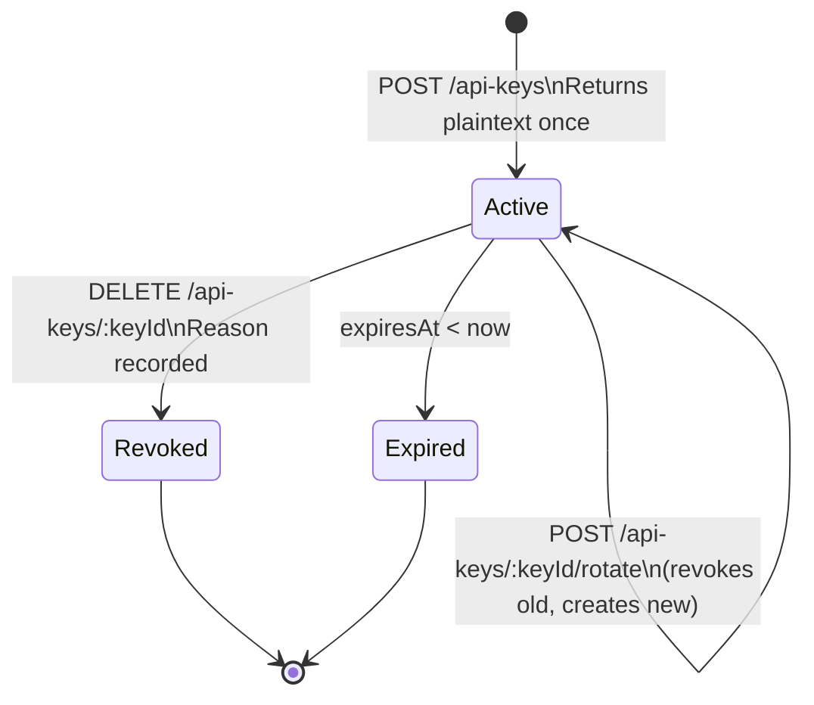
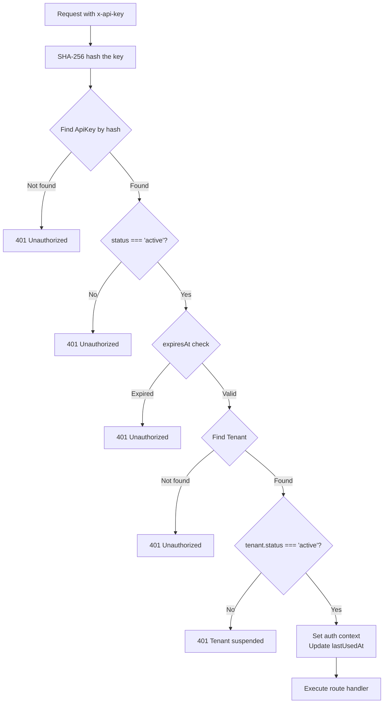
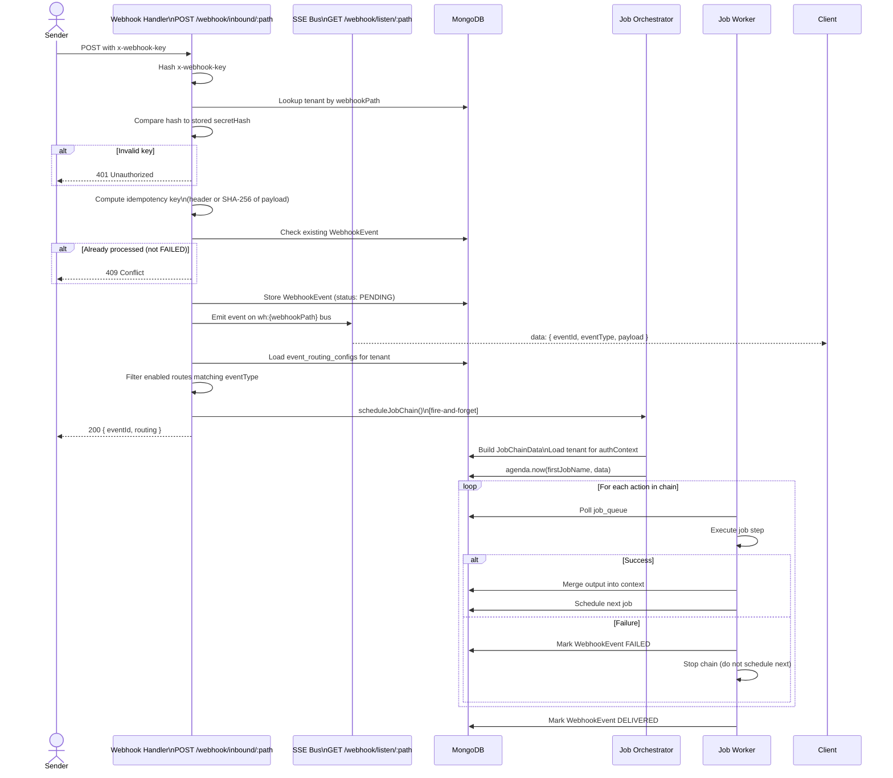
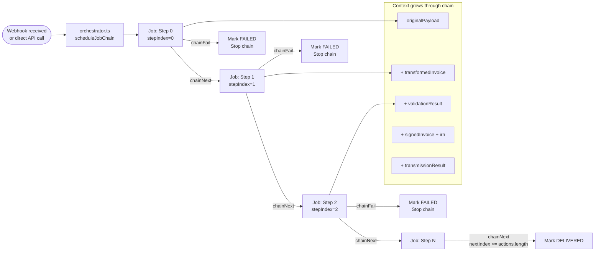
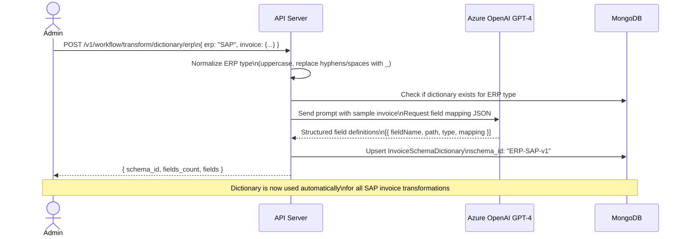
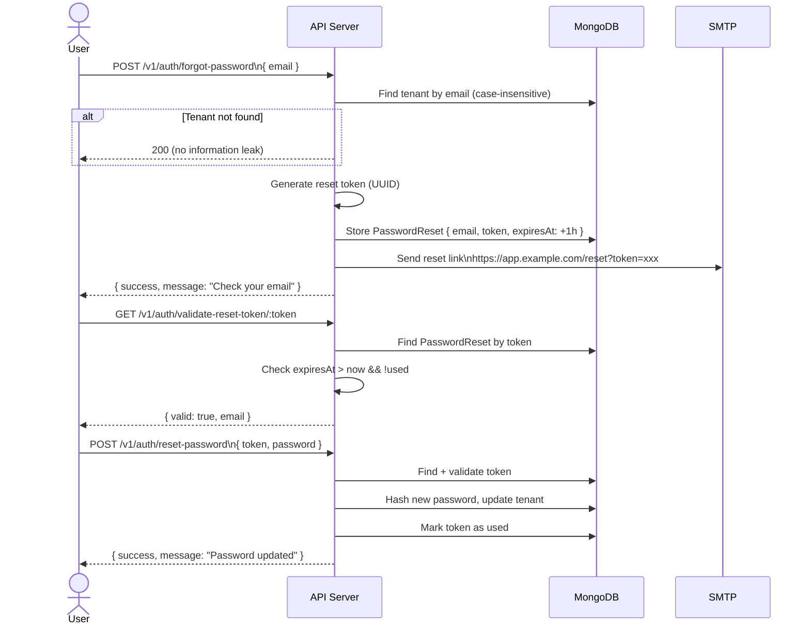
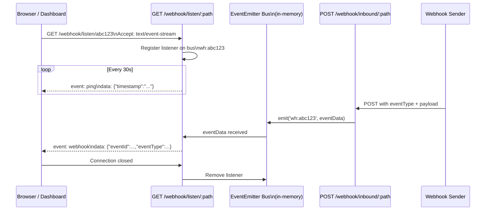

# Activity Flows

Mermaid diagrams for every major operation in the system.

---

## 1. Tenant Onboarding



---

## 2. API Key Lifecycle



---

## 3. Tenant Authentication (API Key)



---

## 4. Outbound Invoice — Full Workflow

```mermaid
flowchart TD
    A[POST /v1/workflow/outbound\nRaw ERP invoice] --> B[OutboundWorkflowService]
    B --> C[Store OutboundInvoice\nstatus: CREATED]

    C --> D{Dictionary exists\nfor erpSystem?}
    D -->|No| D1[Reject: run dictionary setup first]
    D -->|Yes| E[Transform\nMap ERP fields → FIRS UBL]
    E --> F[status: TRANSFORMED]

    F --> G[Validate\nCheck against FIRS schema]
    G --> H{Valid?}
    H -->|No, autoFix=true| I[Attempt auto-fix\nRe-validate up to maxRetries]
    H -->|No, autoFix=false| J[status: FAILED\nReturn errors]
    I --> H
    H -->|Yes| K[status: VALIDATED]

    K --> L[Sign\nRSA-OAEP with tenant certificate]
    L --> M[status: SIGNED]

    M --> N[Generate IRN\nEncrypt invoiceNumber+timestamp]
    N --> O[status: IRN_GENERATED]

    O --> P[Transmit\nPOST to FIRS API]
    P --> Q{FIRS accepted?}
    Q -->|No| R[status: FAILED\nLog FIRS error]
    Q -->|Yes| S[status: TRANSMITTED\nStore FIRS response]

    S --> T[Confirm Status\nVerify FIRS acknowledgment]
    T --> U[Generate QR Code]
    U --> V[status: DELIVERED]

    V --> W{VAT report\nrequired?}
    W -->|Yes| X[Report VAT to FIRS]
    W -->|No| Y[Return response\n{ irn, qrCode }]
    X --> Y
```

---

## 5. Inbound Webhook — Event Processing



---

## 6. Job Chain Execution



---

## 7. LLM Dictionary Generation



---

## 8. Password Reset Flow



---

## 9. SSE Real-Time Event Streaming


