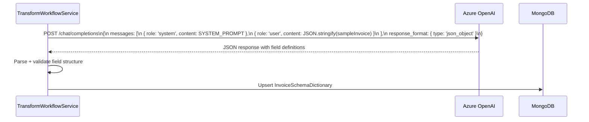
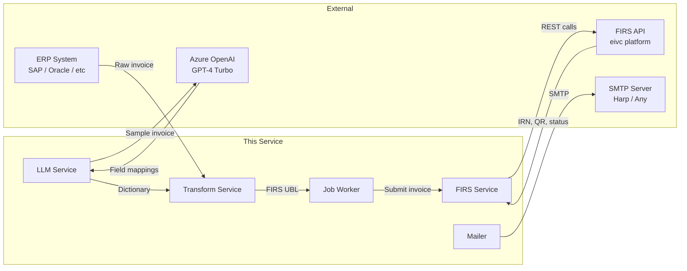

# External Integrations

---

## 1. FIRS (Federal Inland Revenue Service) API

**Purpose**: The central e-invoicing authority. All outbound invoices must be submitted to FIRS. Inbound invoices are downloaded from FIRS.

**Config file**: `src/@config/firs.ts`
**Client**: `src/@lib/adapters/firs/firs.service.ts`

**Base URL**: `https://eivc-k6z6d.ondigitalocean.app/api/v1/`

**Authentication**: API Key + API Secret passed as request headers on every call.

### Operations

| Operation | Method | Endpoint | Purpose |
|-----------|--------|----------|---------|
| OAuth Login | POST | `/auth/login` | Authenticate a business user with FIRS using email/password |
| Transmit Invoice | POST | `/invoices/transmit` | Submit a signed UBL invoice for FIRS processing |
| Confirm Status | GET | `/invoices/:irn/status` | Check if FIRS has acknowledged and processed an IRN |
| Generate QR Code | POST | `/invoices/:irn/qr` | Generate a QR code for a transmitted invoice |
| Decrypt Invoice | POST | `/invoices/decrypt` | Decrypt an encrypted inbound invoice payload |
| Get User Info | GET | `/auth/me` | Retrieve FIRS business details for an authenticated user |
| Report VAT | POST | `/vat/report` | Submit a post-payment VAT report |

### Response Envelope

```json
{
  "code": 200,
  "data": {
    "id": "entity-uuid",
    "status": "submitted",
    "message": "Invoice received",
    "received_at": "2024-01-15T10:30:00Z",
    "entity_id": "firs-business-id"
  }
}
```

### FIRS Invoice Format (FIRS UBL)

FIRS expects invoices in a structured UBL (Universal Business Language) format. The transformation step maps ERP-specific fields to this format using the `InvoiceSchemaDictionary`.

### Error Handling

- 3 retries with 1-second delay (configurable via `FIRS_RETRY_ATTEMPTS`, `FIRS_RETRY_DELAY`)
- 30-second request timeout (configurable via `FIRS_TIMEOUT`)
- FIRS errors stored in `OutboundInvoice.firsResponse`

### SDK

The `firs-einvoicing` package (v1.0.13) is used for:
- Invoice field validation against FIRS schema
- Digital signature verification
- Encrypted payload decryption for inbound invoices

---

## 2. Azure OpenAI (GPT-4 Turbo)

**Purpose**: Auto-generate ERP-to-FIRS field mapping dictionaries from a sample invoice. Eliminates manual schema configuration when onboarding a new ERP type.

**Config file**: `src/@config/ai.ts`
**Client**: `src/@lib/adapters/llm/llm.service.ts`

**Endpoint**: `https://<resource>.openai.azure.com/openai/deployments/<deployment>/chat/completions?api-version=2025-01-01-preview`

**Authentication**: Azure API key in `api-key` header.

### How It Works



### System Prompt

The prompt in `src/@lib/adapters/llm/prompts.ts` instructs the model to:
1. Analyse the input JSON invoice structure
2. Identify all fields and their JSON paths
3. Map each field to the corresponding FIRS UBL field path
4. Specify data type and whether the field is required
5. Return structured JSON only

### Output Format

```json
{
  "fields": [
    {
      "fieldName": "invoiceNumber",
      "path": "header.documentNumber",
      "type": "string",
      "required": true,
      "mapping": {
        "target": "Invoice.ID",
        "transform": null
      }
    }
  ]
}
```

### Cost Considerations
- Each dictionary generation is one LLM call (typically 2000–4000 tokens)
- Dictionaries are cached in MongoDB (`invoice_schema_dictionaries`) — the LLM is only called when creating or regenerating a dictionary, not on every invoice

---

## 3. SMTP Email (Harp Sandbox)

**Purpose**: Transactional email for tenant lifecycle events.

**Config file**: `src/@config/messaging.ts`
**Client**: `src/@lib/messaging/index.ts` (Nodemailer)

**Default Provider**: Harp Sandbox (`sandbox.smtp.getharp.io:2525`)
**Template Engine**: Handlebars

### Emails Sent

| Event | Recipient | Subject | Content |
|-------|-----------|---------|---------|
| Tenant created | `contactEmail` | Welcome to E-Invoicing | Activation link (JWT, 12h expiry) |
| Password reset requested | User | Reset your password | Reset link with token (1h expiry) |
| API key rotated | Tenant admin | Your API key was rotated | New key info (if `sendEmail: true`) |
| Team member invited | New member | You've been invited | Invitation link |

### Template Variables (Handlebars)

```handlebars
Hello {{businessName}},

Please activate your account: {{{activationUrl}}}

This link expires in {{expiryHours}} hours.
```

### Changing Provider

Switch providers by updating `SMTP_HOST`, `SMTP_PORT`, `SMTP_USER`, `SMTP_PASS`. The Nodemailer client is provider-agnostic. Compatible with:
- Mailgun, SendGrid, AWS SES (via SMTP relay)
- Any SMTP-compatible provider

---

## 4. Redis (Optional)

**Purpose**: Rate limiting and caching (configured, not heavily used in current implementation).

**Config file**: `src/@config/redis.ts`

**Connection**: `REDIS_URL` env var (default: `redis://localhost:6379`)

**Current usage**: Infrastructure is set up and injectable, but no active rate-limit enforcement is implemented in routes. This is the recommended place to add:
- API rate limiting per tenant (slide window counter)
- Webhook event deduplication cache
- Session caching

---

## Integration Points Summary


