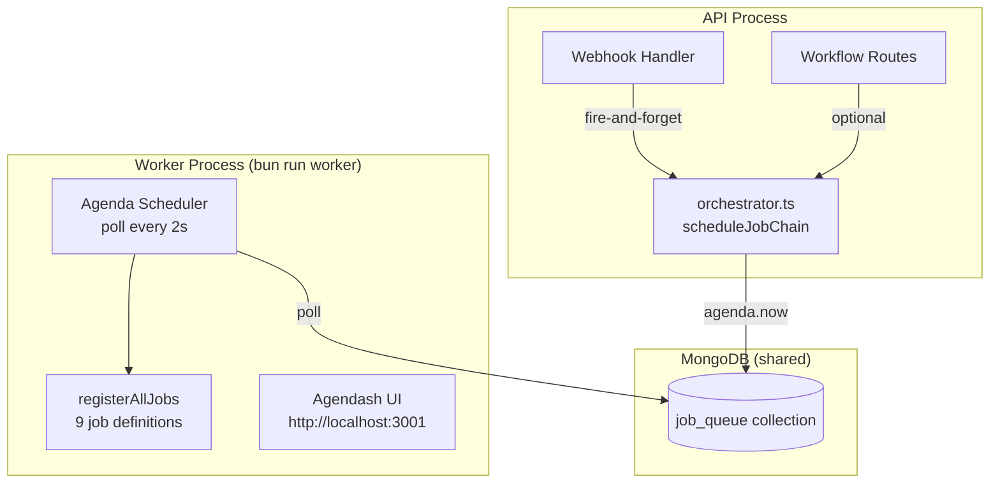

# Background Job System

The job system uses [Agenda](https://github.com/agenda/agenda) v6 with a MongoDB backend to process invoice workflows asynchronously. The job worker runs as a separate process from the API server.

---

## Architecture



---

## Worker Startup Sequence

```
bun run worker
  │
  ├─ 1. connectMongo()              ← same DB as API
  ├─ 2. registerAllJobs()           ← defines all 9 job types
  ├─ 3. agenda.start()              ← begins polling job_queue every 2s
  ├─ 4. Express + Agendash on :3001 ← dashboard UI
  └─ 5. SIGTERM/SIGINT → agenda.stop()
```

---

## Agenda Configuration

| Setting | Value | Description |
|---------|-------|-------------|
| `processEvery` | `2 seconds` | How often to poll for new jobs |
| `defaultConcurrency` | `5` | Max parallel jobs of same type per worker |
| `maxConcurrency` | `20` | Global max parallel jobs |
| `defaultLockLifetime` | `5 minutes` | Job lock TTL (prevents double-execution) |
| `backend` | `MongoBackend` | MongoDB collection: `job_queue` |

---

## Job Chain Data Envelope

Every job in a chain shares the same data structure:

```typescript
interface JobChainData {
  // Identity
  jobChainId: string;        // UUID — traces the full chain
  webhookEventId: string;    // Links back to WebhookEvent document
  tenantId: string;
  eventType: string;

  // Chain position
  actions: string[];         // Full ordered list, e.g., ['transform', 'validate', 'sign']
  stepIndex: number;         // 0-based current position

  // Auth — resolved once from tenant, reused across all steps
  authContext: {
    tenantId: string;
    businessId?: string;
    businessTIN?: string;
    serviceId?: string;
    tenantERP?: string;
    isAdmin: false;
  };

  // Pipeline context — grows as each step appends its output
  context: {
    originalPayload: any;
    sourceType?: string;
    irn?: string;
    transformedInvoice?: any;
    validationResult?: any;
    signedInvoice?: any;
    qrCode?: string;
    transmissionResult?: any;
    vatReportResult?: any;
    statusCheckResult?: any;
    inboundResult?: any;
    [key: string]: any;
  };

  priority: number;
  routeId?: string;
}
```

---

## Action → Job Name Mapping

| Action ID | Agenda Job Name | Input from context | Output to context |
|-----------|----------------|-------------------|------------------|
| `generate_irn` | `workflow:generate-irn` | `originalPayload` | `irn` |
| `transform` | `workflow:transform` | `originalPayload`, `sourceType` | `transformedInvoice` |
| `validate` | `workflow:validate` | `transformedInvoice` \| `originalPayload` | `validationResult` |
| `sign` | `workflow:sign` | `transformedInvoice` \| `originalPayload` | `signedInvoice` |
| `transmit` | `workflow:transmit` | `irn` (required) | `transmissionResult` |
| `complete_outbound` | `workflow:complete-outbound` | `originalPayload` | `qrCode`, `signedInvoice` |
| `complete_inbound` | `workflow:complete-inbound` | `originalPayload` | `inboundResult` |
| `report_vat` | `workflow:report-vat` | `irn`, `context.vatReportData` | `vatReportResult` |
| `confirm_invoice_status` | `workflow:confirm-status` | `irn` | `statusCheckResult` |

---

## Job Definitions

### `workflow:generate-irn`

**File**: `src/v1/workflow/jobs/definitions/generate-irn.job.ts`

Resolves or generates an Invoice Reference Number for the invoice being processed.

**Logic**:
1. Check `context.irn` — if already present, use it
2. Look up existing `OutboundInvoice` record by IRN
3. If not found, generate a new IRN: `IRN-{tenantId[0..5].toUpperCase()}-{Date.now()}`

**Output**: `{ irn }`

---

### `workflow:transform`

**File**: `src/v1/workflow/jobs/definitions/transform.job.ts`

Maps the raw ERP invoice fields to FIRS UBL format using the tenant's schema dictionary.

**Logic**: Calls `TransformWorkflowService.transformInvoice(originalPayload, authContext, sourceType)`

**Output**: `{ transformedInvoice }`

---

### `workflow:validate`

**File**: `src/v1/workflow/jobs/definitions/validate.job.ts`

Validates the transformed invoice against FIRS schema requirements.

**Input**: `context.transformedInvoice` (falls back to `context.originalPayload`)

**Logic**:
1. Calls `InvoiceWorkflowService.validateInvoice(businessId, invoice)`
2. If `result.valid === false`, throws with error list — chain fails

**Output**: `{ validationResult }`

---

### `workflow:sign`

**File**: `src/v1/workflow/jobs/definitions/sign.job.ts`

Digitally signs the invoice with the tenant's FIRS certificate.

**Input**: `context.transformedInvoice` (falls back to `context.originalPayload`)

**Logic**:
1. Calls `InvoiceWorkflowService.signInvoice(authContext, invoice)`
2. If `result.signed === false`, throws

**Output**: `{ signedInvoice }`

---

### `workflow:transmit`

**File**: `src/v1/workflow/jobs/definitions/transmit.job.ts`

Sends the signed invoice to the FIRS API.

**Requires**: `context.irn` — throws if absent (run `generate_irn` first)

**Logic**: Calls `InvoiceWorkflowService.transmitInvoice(authContext, irn)`

**Output**: `{ transmissionResult }`

---

### `workflow:complete-outbound`

**File**: `src/v1/workflow/jobs/definitions/complete-outbound.job.ts`

Runs the full outbound pipeline in one shot (convenience job for simple workflows).

**Logic**: Calls `OutboundWorkflowService.handleOutboundWorkflow(originalPayload, transmit=true)`

**Output**: `{ qrCode, signedInvoice }`

---

### `workflow:complete-inbound`

**File**: `src/v1/workflow/jobs/definitions/complete-inbound.job.ts`

Runs the full inbound pipeline in one shot.

**Logic**: Calls `InboundWorkflowService.handleInboundWorkflow(originalPayload)`

**Output**: `{ inboundResult }`

---

### `workflow:report-vat`

**File**: `src/v1/workflow/jobs/definitions/report-vat.job.ts`

Submits a VAT report to FIRS for a transmitted invoice.

**Requires**: `context.irn` and `context.vatReportData` (or `originalPayload.vatReportData`)

**Logic**: Calls `InvoiceWorkflowService.reportInvoice({ ...vatData, irn })`

**Output**: `{ vatReportResult }`

---

### `workflow:confirm-status`

**File**: `src/v1/workflow/jobs/definitions/confirm-status.job.ts`

Polls FIRS to confirm the invoice was received and processed.

**Requires**: `context.irn`

**Logic**: Calls `InvoiceWorkflowService.confirmInvoiceStatus(businessId, irn)`

**Output**: `{ statusCheckResult }`

---

## Chain Helpers (`chain.ts`)

### `chainNext(job, stepOutput)`

Called at the end of every successful job step:

1. Merges `stepOutput` into `context`
2. Increments `stepIndex`
3. If `stepIndex >= actions.length` → marks `WebhookEvent` as `DELIVERED`, stops
4. Otherwise → looks up next job name, calls `agenda.now(nextJobName, nextData)`

### `chainFail(job, error)`

Called when a step throws an error:

1. Logs the failure with step details
2. Marks `WebhookEvent` as `FAILED` with the error message
3. Returns (does not schedule next step — chain halts)

---

## Job Orchestrator (`orchestrator.ts`)

`scheduleJobChain(input)` is the entry point called from the webhook handler and workflow routes:

```typescript
async function scheduleJobChain(input: {
  webhookEventId: string;
  tenantId: string;
  eventType: string;
  payload: any;
  actions: string[];
  routeId?: string;
  priority?: number;
}): Promise<string>  // returns jobChainId
```

**Steps**:
1. Validate all action IDs are known (from `ACTION_TO_JOB` map)
2. Load tenant from DB to build `authContext`
3. Generate `jobChainId` (UUID)
4. Resolve priority (explicit > event-type map > 0)
5. Build `JobChainData` with `stepIndex: 0`
6. Call `agenda.now(firstJobName, data)` → job persisted in MongoDB
7. Set priority on job, save
8. Return `jobChainId`

**Called as fire-and-forget** from the webhook handler:
```typescript
scheduleJobChain({ ... })
  .then((id) => { jobChainId = id; })
  .catch((err) => logger.error('Failed to schedule job chain', { err }));
```

---

## Priority System

Higher priority jobs are processed first by Agenda.

| Event Type | Priority |
|------------|---------|
| `invoice.failed` | 10 (urgent) |
| `invoice.received` | 5 |
| `invoice.created` | 5 |
| `erp.invoice.submitted` | 5 |
| *(all others)* | 0 |

Priority can also be set explicitly via the `priority` field in the event routing config (future).

---

## Failure Handling

```mermaid
flowchart TD
    JOB[Job executes] --> TRY{Success?}
    TRY -->|Yes| NEXT[chainNext → schedule next step]
    TRY -->|No| FAIL[chainFail → mark WebhookEvent FAILED]
    FAIL --> RETHROW[throw error]
    RETHROW --> AGENDA_RETRY{Agenda retry\n(failCount < maxRetries)?}
    AGENDA_RETRY -->|Yes| JOB
    AGENDA_RETRY -->|No| DEAD[Job marked failed in job_queue\nVisible in Agendash]
```

Agenda automatically retries failed jobs based on the `backoff` strategy configured per job (defaults to immediate retry). View and manually retry failed jobs in the Agendash dashboard at `http://localhost:3001`.

---

## Agendash Dashboard

Access at `http://localhost:3001` (or `$AGENDASH_PORT`).

**Features**:
- Real-time job queue overview
- Filter by job name, status, date range
- Manually run, reschedule, or delete jobs
- View job data payload and failure errors
- Monitor concurrency and lock states

> **Security note**: The Agendash dashboard has no authentication in the current implementation. In production, place it behind a VPN or add basic-auth at the reverse-proxy level.
