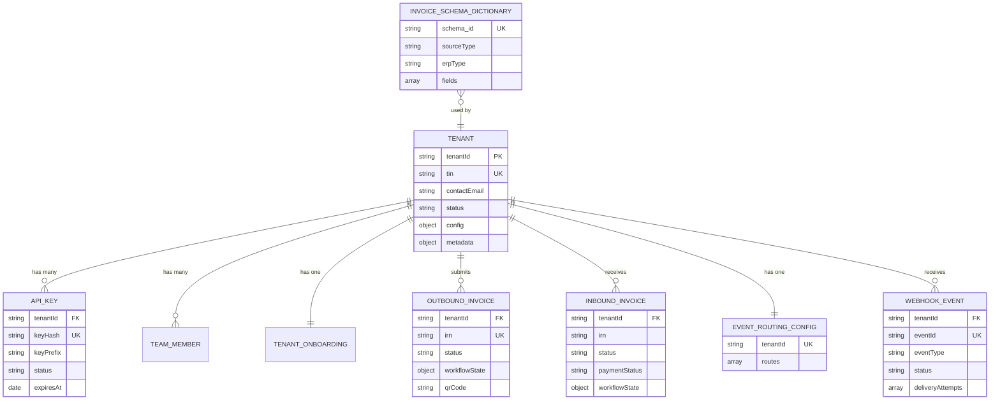

# Data Models

All persistence uses MongoDB via Mongoose. Every model is defined with a TypeScript interface for the document shape and a Mongoose Schema. Below are all collections and their schemas.

---

## Collection Map

| Collection | Model | Purpose |
|------------|-------|---------|
| `tenants` | `Tenant` | Core business entity |
| `api_keys` | `ApiKey` | Authentication keys per tenant |
| `team_members` | `TeamMember` | Sub-accounts per tenant |
| `tenant_onboardings` | `TenantOnboarding` | Step-by-step onboarding tracker |
| `outbound_invoices` | `OutboundInvoice` | ERP → FIRS invoice submissions |
| `inbound_invoices` | `InboundInvoice` | FIRS → ERP received invoices |
| `invoice_schema_dictionaries` | `InvoiceSchemaDictionary` | Field mapping rules (LLM-generated) |
| `webhook_events` | `WebhookEvent` | Inbound webhook event log |
| `event_routing_configs` | `EventRoutingConfig` | Per-tenant event→action routing |
| `system_configs` | `SystemConfig` | Key-value system configuration |
| `audit_logs` | `AuditLog` | Compliance audit trail |
| `password_resets` | `PasswordReset` | Password reset tokens |
| `job_queue` | Agenda | Background job state (managed by Agenda) |

---

## Tenant

**Collection**: `tenants`

```typescript
interface ITenantConfig {
  firsCredentials?: {
    clientId?: string;
    serviceId?: string;       // FIRS service ID
    certificate?: string;     // PEM certificate (encrypted)
    publicKey?: string;       // PEM public key (encrypted)
  };
  erpSyncConfig?: {
    name: string;
    method: 'GET' | 'POST' | 'PUT';
    baseUrl: string;
    endpoint: string;
    auth: { type: 'bearer' | 'basic' | 'apikey'; token?: string; };
    payloadTemplate?: object;
    schedule?: string;        // cron expression
  };
  erpSystem: string;          // e.g., 'SAP', 'Oracle', 'QuickBooks'
  webhookUrl?: string;
  webhookAuth?: string;
  webhookEnabled?: boolean;
  features?: {
    autoFix: boolean;
    maxRetries: number;
    qrCodeGeneration: boolean;
  };
  limits?: {
    monthlyInvoiceLimit: number;
    apiRateLimit: number;
  };
}

interface TenantDocument {
  tenantId: string;                 // unique, indexed
  businessRegistrationNumber: string;
  businessName: string;
  tin: string;                      // Tax Identification Number, unique
  contactEmail: string;
  contactPhone?: string;
  password?: string;                // SHA-256 hash
  erpSystem?: string;
  status: 'onboarding' | 'active' | 'suspended' | 'inactive';
  config?: ITenantConfig;
  metadata?: Record<string, any>;   // includes webhookPath, webhookSecretHash
  createdAt: Date;
  updatedAt: Date;
  createdBy?: string;
}
```

**Indexes**: `tenantId` (unique), `tin` (unique), `contactEmail`

---

## ApiKey

**Collection**: `api_keys`

```typescript
interface ApiKeyDocument {
  tenantId: string;         // indexed
  keyHash: string;          // SHA-256 of plaintext key, unique
  keyPrefix: string;        // first 8 chars for display (e.g., "eim_xxxx")
  name: string;
  description?: string;
  scopes: string[];         // e.g., ['invoices:read', 'invoices:write'] or ['*']
  lastUsedAt?: Date;
  usageCount: number;
  expiresAt?: Date;
  status: 'active' | 'revoked' | 'expired';
  revokedAt?: Date;
  revokedBy?: string;
  revokedReason?: string;
  createdAt: Date;
  updatedAt: Date;
}
```

**Indexes**: `tenantId`, `keyHash` (unique)

---

## TeamMember

**Collection**: `team_members`

```typescript
interface TeamMemberDocument {
  tenantId: string;
  userId: string;         // unique per tenant
  email: string;
  name?: string;
  role: 'admin' | 'member' | 'viewer';
  permissions: string[];
  password?: string;      // SHA-256 hash
  status: 'active' | 'invited' | 'suspended';
  invitedAt?: Date;
  activatedAt?: Date;
  lastLoginAt?: Date;
  createdAt: Date;
  updatedAt: Date;
}
```

---

## TenantOnboarding

**Collection**: `tenant_onboardings`

```typescript
interface TenantOnboardingDocument {
  tenantId: string;   // unique
  status: 'pending' | 'in_progress' | 'completed';
  steps: {
    registration:       { completed: boolean; completedAt?: Date };
    firsProvisioning:   { completed: boolean; completedAt?: Date };
    erpConfiguration:   { completed: boolean; completedAt?: Date };
    testing:            { completed: boolean; completedAt?: Date };
  };
  approvedAt?: Date;
  metadata?: Record<string, any>;
  createdAt: Date;
  updatedAt: Date;
}
```

---

## OutboundInvoice

**Collection**: `outbound_invoices`

```typescript
type OutboundStatus = 'CREATED' | 'VALIDATED' | 'SIGNED' | 'TRANSMITTED' | 'DELIVERED' | 'FAILED';

interface OutboundInvoiceDocument {
  tenantId: string;
  irn: string;          // unique Invoice Reference Number
  status: OutboundStatus;
  workflowState: {
    transformed: boolean;
    validated: boolean;
    signed: boolean;
    transmitted: boolean;
    delivered: boolean;
  };
  originalPayload?: any;       // raw ERP input
  transformedInvoice?: any;    // FIRS UBL format
  signedInvoice?: any;
  qrCode?: string;             // base64 PNG
  validationAttempts: number;
  validationErrors: Array<{
    attempt: number;
    errors: string[];
    fixed: boolean;
  }>;
  erpSystem?: string;
  sourceType?: string;
  firsResponse?: any;          // raw FIRS API response
  metadata?: Record<string, any>;
  createdAt: Date;
  updatedAt: Date;
  createdBy?: string;
}
```

**Indexes**: `tenantId`, `irn` (unique), `status`

---

## InboundInvoice

**Collection**: `inbound_invoices`

```typescript
type InboundStatus = 'TRANSMITTED' | 'ACKNOWLEDGED' | 'DOWNLOADED' | 'SYNCED_TO_ERP' | 'PAID' | 'REJECTED' | 'CANCELED';
type PaymentStatus = 'PENDING' | 'PAID' | 'PARTIAL' | 'OVERDUE';

interface InboundInvoiceDocument {
  tenantId: string;
  businessId: string;
  irn: string;
  status: InboundStatus;
  workflowState: {
    notified: boolean;
    acknowledged: boolean;
    downloaded: boolean;
    synced: boolean;
    paymentUpdated: boolean;
  };
  invoice?: any;           // raw encrypted FIRS invoice
  decryptedData?: any;
  supplierTIN: string;
  supplierName?: string;
  invoiceNumber?: string;
  issueDate?: Date;
  dueDate?: Date;
  totalAmount?: number;
  currency?: string;
  paymentStatus: PaymentStatus;
  paymentDetails?: {
    paymentDate?: Date;
    paymentMethod?: string;
    transactionReference?: string;
    amountPaid?: number;
  };
  metadata?: Record<string, any>;
  createdAt: Date;
  updatedAt: Date;
  createdBy?: string;
}
```

---

## InvoiceSchemaDictionary

**Collection**: `invoice_schema_dictionaries`

```typescript
interface FieldDefinition {
  fieldName: string;
  path: string;             // JSON path in source (e.g., "header.invoiceNumber")
  type: 'string' | 'number' | 'boolean' | 'date' | 'object' | 'array';
  required: boolean;
  mapping?: {
    target: string;         // FIRS UBL target path
    transform?: string;     // Optional transformation expression
  };
  description?: string;
}

interface InvoiceSchemaDictionaryDocument {
  schema_id: string;        // e.g., "ERP-SAP-v1", unique
  sourceType: 'ERP' | 'FIRS_UBL';
  erpType?: string;         // e.g., 'SAP', 'Oracle'
  fields: FieldDefinition[];
  status: 'active' | 'deprecated';
  version: number;
  createdBy?: string;
  metadata?: {
    source_invoice_sample?: any;
    generated_at?: Date;
    model_used?: string;
  };
  createdAt: Date;
  updatedAt: Date;
}
```

**Indexes**: `schema_id` (unique), `sourceType`, `erpType`

---

## WebhookEvent

**Collection**: `webhook_events`

```typescript
type WebhookDeliveryStatus = 'pending' | 'delivered' | 'failed' | 'retry';

interface DeliveryAttempt {
  attemptNumber: number;
  timestamp: Date;
  httpStatus?: number;
  responseBody?: any;
  error?: string;
  duration?: number;    // ms
}

interface WebhookEventDocument {
  tenantId: string;           // indexed
  eventId: string;            // unique (UUID or from header)
  eventType: string;          // indexed (e.g., 'invoice.received')
  payload: any;
  resourceId?: string;
  resourceType?: string;
  webhookUrl?: string;
  status: WebhookDeliveryStatus;
  deliveryAttempts: DeliveryAttempt[];
  maxRetries: number;
  nextRetryAt?: Date;
  finalHttpStatus?: number;
  finalResponseBody?: any;
  deliveredAt?: Date;
  failedAt?: Date;
  failureReason?: string;
  metadata?: Record<string, any>;  // includes idempotencyKey, jobChainId
  createdAt: Date;
  updatedAt: Date;
}
```

**Indexes**: `tenantId`, `eventId` (unique), `eventType`, `status`

---

## EventRoutingConfig

**Collection**: `event_routing_configs`

```typescript
interface IEventRoute {
  routeId: string;          // 16-char hex, generated by system
  event: string;            // event type id (e.g., 'invoice.received')
  actions: string[];        // ordered action ids (e.g., ['transform', 'validate', 'transmit'])
  enabled: boolean;
  description?: string;
}

interface EventRoutingDocument {
  tenantId: string;         // unique — one config document per tenant
  routes: IEventRoute[];
  createdAt: Date;
  updatedAt: Date;
}
```

**Indexes**: `tenantId` (unique)

---

## SystemConfig

**Collection**: `system_configs`

```typescript
interface SystemConfigDocument {
  key: string;              // e.g., 'firs_dictionary', 'erp_sap_dictionary'
  value: any;               // stored configuration data
  version?: number;
  createdAt: Date;
  updatedAt: Date;
}
```

---

## AuditLog

**Collection**: `audit_logs`

```typescript
interface AuditLogDocument {
  tenantId?: string;
  action: string;           // e.g., 'CREATE_TENANT', 'REVOKE_API_KEY'
  resource: string;         // e.g., 'tenant', 'api_key'
  resourceId?: string;
  actor: string;            // userId, tenantId, or 'system'
  changes?: Record<string, { before: any; after: any }>;
  metadata?: Record<string, any>;
  createdAt: Date;
}
```

---

## PasswordReset

**Collection**: `password_resets`

```typescript
interface PasswordResetDocument {
  email: string;
  token: string;            // UUID or random hex
  expiresAt: Date;          // typically 1 hour from creation
  used: boolean;
  usedAt?: Date;
  createdAt: Date;
}
```

**Indexes**: `token` (unique), `email`

---

## Entity Relationship Diagram


